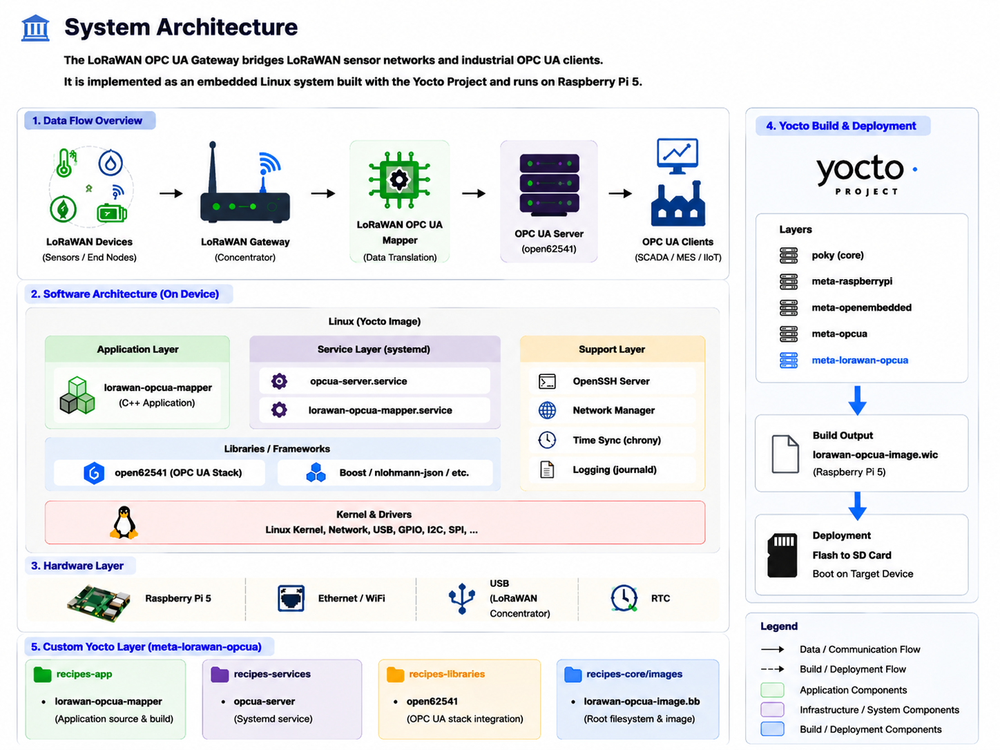

# LoRaWAN → OPC UA Gateway (Yocto-based System)

## Overview
This project implements a **LoRaWAN to OPC UA gateway** using a custom Yocto layer targeting Raspberry Pi 5.

It bridges:
- LoRaWAN IoT devices
- Industrial OPC UA systems

---

## System Architecture



---

## High-Level Components

### 1. LoRaWAN Stack
Handles sensor communication from distributed IoT nodes.

### 2. Mapper Service
Converts LoRaWAN payloads into OPC UA nodes/variables.

### 3. OPC UA Server
Based on open62541, exposes industrial data model.

### 4. Yocto Image
Custom Linux image built via `meta-lorawan-opcua`.

---

## OPC UA Data Flow

1. Sensor sends LoRaWAN packet  
2. Gateway receives packet  
3. Mapper parses payload  
4. Data mapped to OPC UA node  
5. OPC UA client subscribes to variables  

---

## Yocto Build

```bash
source oe-init-build-env build-rpi5
bitbake lorawan-opcua-image

---

## Documentation

Full project documentation is available in the `docs/` directory:

- 📘 Architecture: docs/01_Architecture
- ⚙️ Yocto Build System: docs/02_Yocto
- 🔁 OPC UA Flow: docs/03_OPCUA_Flow
- 🖼 Assets: docs/assets/images

